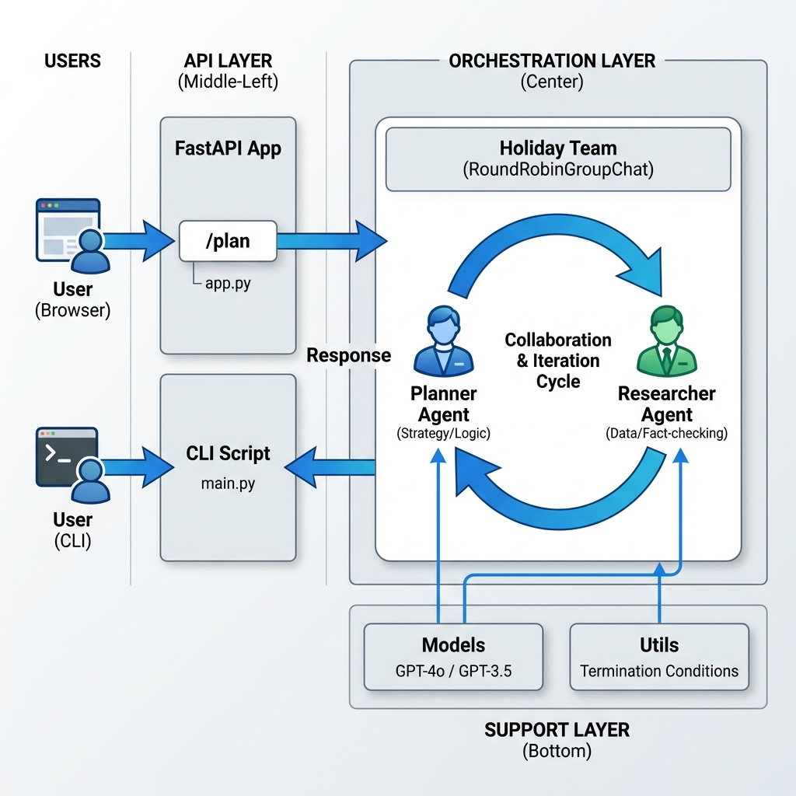

# 🏖️ Personalized Holiday Management Agent

<div align="center">

[](https://www.python.org/)
[](https://fastapi.tiangolo.com/)
[](https://openai.com/)
[](LICENSE)
[](https://github.com)

**An intelligent multi-agent AI system for personalized travel planning and itinerary generation**

[Features](#-features) • [Installation](#-installation) • [Usage](#-usage) • [Architecture](#-architecture) • [Contributing](#-contributing)

</div>

---

## 📋 Table of Contents

- [Overview](#-overview)
- [Key Features](#-features)
- [Technology Stack](#-technology-stack)
- [Project Architecture](#-architecture)
- [Installation Guide](#-installation)
  - [Using pip](#using-pip)
  - [Using UV (Recommended)](#using-uv-recommended--faster)
  - [Using conda](#using-conda)
- [Quick Start](#-quick-start)
- [Project Structure](#-project-structure)
- [Usage Examples](#-usage-examples)
- [Contributing](#-contributing)
- [License](#-license)

---

## 🎯 Overview

**Holiday Management Agent** is an autonomous multi-agent AI system designed to solve complex travel planning challenges. Unlike traditional chatbots that often generate inaccurate information, this system separates reasoning into distinct phases:

- **Planning Phase**: Creates a high-level skeleton itinerary with geography and logistics
- **Research Phase**: Validates all information in real-time (prices, hours, locations)
- **Generation Phase**: Produces a clean, day-by-day travel guide

It transforms vague user prompts like *"I want a 7-day trip to Japan focusing on anime and food"* into concrete, verified itineraries ready for travel.

---

## ✨ Features

- 🤖 **Multi-Agent Architecture**: Specialized agents for planning and research
- ✅ **Hallucination Prevention**: Real-time data validation before final output
- 📅 **Smart Itinerary Generation**: Day-by-day travel plans with logistics
- 🔍 **Real-time Verification**: Validates prices, hours, and locations
- 📊 **Structured Output**: Clean, formatted Markdown itineraries
- 🌐 **Web-based Interface**: User-friendly FastAPI frontend
- 🔐 **Secure**: Environment-based configuration for API keys
- 🚀 **Scalable**: Sequential multi-agent pattern for easy extension

---

## 🛠️ Technology Stack

| Component | Technology |
|-----------|-----------|
| **Language** | Python 3.10+ |
| **Web Framework** | FastAPI |
| **LLM Orchestration** | AutoGen + OpenAI API (GPT-4o) |
| **Data Validation** | Pydantic |
| **Server** | Uvicorn |
| **Database** | Chroma (Vector DB) |
| **Async Runtime** | asyncio |

---

## 🏗️ Architecture

### System Design



### Agent Workflow

```
User Input
    ↓
State Initialization
    ↓
Holiday Planner Agent (Strategy Layer)
    ├─ Analyze user constraints
    ├─ Create skeleton itinerary
    └─ Output: Generic activities list
    ↓
Holiday Researcher Agent (Data Layer)
    ├─ Verify attractions
    ├─ Validate prices & hours
    └─ Output: Verified facts dictionary
    ↓
Final Itinerary (Markdown)
```

### Key Components

- **Agents**: Independent AI units with specialized roles
  - `Holiday Planner`: Strategic planning and itinerary structure
  - `Holiday Researcher`: Data validation and fact-checking
  
- **Teams**: Orchestration layer managing agent communication
  - `RoundRobinGroupChat`: Coordinates multi-agent workflow
  
- **Models**: LLM client configuration for OpenAI integration

- **Utils**: Shared utilities for state management and validation

---

## 📦 Installation

### Prerequisites

- Python 3.10 or higher
- OpenAI API key (get one at [platform.openai.com](https://platform.openai.com))
- Git

### Using pip

1. **Clone the repository**
   ```bash
   git clone https://github.com/yourusername/Personalized-Holiday-Management-Agent.git
   cd Personalized-Holiday-Management-Agent
   ```

2. **Create a virtual environment**
   ```bash
   python -m venv venv
   source venv/bin/activate  # On Windows: venv\Scripts\activate
   ```

3. **Install dependencies**
   ```bash
   pip install -r requirements.txt
   ```

4. **Configure environment variables**
   ```bash
   cp .env.example .env
   # Edit .env and add your OpenAI API key
   ```

5. **Run the application**
   ```bash
   uvicorn app:app --reload
   ```

### Using UV (Recommended ⚡ Faster)

UV is a blazing-fast Python package installer and resolver, written in Rust. It's significantly faster than traditional pip.

1. **Install UV** (if you haven't already)
   ```bash
   # On Windows
   powershell -ExecutionPolicy BypassCurrentUser -c "irm https://astral.sh/uv/install.ps1 | iex"
   
   # On macOS/Linux
   curl -LsSf https://astral.sh/uv/install.sh | sh
   ```

2. **Clone the repository**
   ```bash
   git clone https://github.com/yourusername/Personalized-Holiday-Management-Agent.git
   cd Personalized-Holiday-Management-Agent
   ```

3. **Create project with UV**
   ```bash
   uv venv
   source .venv/bin/activate  # On Windows: .venv\Scripts\activate
   ```

4. **Install dependencies using UV**
   ```bash
   uv pip install -r requirements.txt
   ```

   Or use a `pyproject.toml` with UV (faster):
   ```bash
   uv pip install -e .
   ```

5. **Configure environment variables**
   ```bash
   cp .env.example .env
   # Edit .env and add your OpenAI API key
   ```

6. **Run the application**
   ```bash
   uv run uvicorn app:app --reload
   ```

**Benefits of using UV:**
- ⚡ 10-100x faster package installation
- 🔒 Better dependency resolution
- 📦 Lower memory usage
- 🚀 Simplified workflow with `uv run`

### Using conda

1. **Clone the repository**
   ```bash
   git clone https://github.com/yourusername/Personalized-Holiday-Management-Agent.git
   cd Personalized-Holiday-Management-Agent
   ```

2. **Create a conda environment**
   ```bash
   conda create -n holiday_agent python=3.12 -y
   conda activate holiday_agent
   ```

3. **Install dependencies**
   ```bash
   pip install -r requirements.txt
   ```

4. **Configure environment variables**
   ```bash
   cp .env.example .env
   # Edit .env and add your OpenAI API key
   ```

5. **Run the application**
   ```bash
   uvicorn app:app --reload
   ```

---

## 🚀 Quick Start

1. **Set up your environment** (follow installation steps above)

2. **Start the FastAPI server**
   ```bash
   uvicorn app:app --reload
   ```
   
   Server will be available at: `http://localhost:8000`

3. **Access the web interface**
   - Open your browser and navigate to `http://localhost:8000`
   - Enter your travel requirements (destination, dates, interests)
   - Get a personalized itinerary

4. **Use the API directly**
   ```bash
   curl -X POST "http://localhost:8000/plan" \
     -H "Content-Type: application/json" \
     -d '{"content": "7-day trip to Japan focusing on anime and food", "source": "User"}'
   ```

---

## 📁 Project Structure

```
Personalized-Holiday-Management-Agent/
├── 📄 README.md                          # Project documentation
├── 📄 requirements.txt                   # Python dependencies
├── 📄 setup.py                           # Package setup configuration
├── 📄 app.py                             # FastAPI application entry point
├── 📄 main.py                            # Alternative entry point
│
├── 🎨 static/                            # Frontend static assets
│   └── styles.css                        # CSS styling
│
├── 🌐 templates/                         # HTML templates
│   └── index.html                        # Web interface
│
├── 📁 Assets/                            # Architecture and design files
│   └── architecture_OFRxBxZ.jpg         # System architecture diagram
│
├── 📁 docs/                              # Project documentation (generated)
│   ├── ARCHITECTURE.md                   # Detailed architecture guide
│   ├── API.md                            # API documentation
│   └── SETUP.md                          # Detailed setup guide
│
├── 📁 workflows/                         # Workflow diagrams (generated)
│   ├── overall_workflow.md               # Main system workflow
│   ├── planning_agent_workflow.md        # Planner agent flow
│   ├── research_agent_workflow.md        # Researcher agent flow
│   └── fastapi_flow.md                   # API flow diagram
│
├── 📦 holiday_management/                # Main package
│   ├── __init__.py
│   │
│   ├── 🤖 agents/                        # AI agents
│   │   ├── __init__.py
│   │   ├── planner.py                    # Holiday planning agent
│   │   └── researcher.py                 # Holiday research agent
│   │
│   ├── ⚙️ config/                        # Configuration
│   │   ├── __init__.py
│   │   └── settings.py                   # Application settings
│   │
│   ├── 🧠 models/                        # LLM models
│   │   ├── __init__.py
│   │   └── gpt_model.py                  # OpenAI model client
│   │
│   ├── 👥 teams/                         # Agent teams
│   │   ├── __init__.py
│   │   └── holiday_team.py               # Multi-agent orchestration
│   │
│   └── 🛠️ utils/                         # Utilities
│       ├── __init__.py
│       └── utils.py                      # Helper functions
│
├── 📁 all-utils/                         # Utility notebooks and scripts
│   ├── main.py
│   ├── requirements.txt
│   ├── logging_example.py
│   ├── mem0_example.py
│   ├── pydantic_models.py
│   └── utilities/                        # Jupyter notebooks and examples
│
└── 📁 holiday_management.egg-info/       # Package metadata
    └── ...
```

---

## 💡 Usage Examples

### Example 1: Basic Trip Planning
```bash
curl -X POST "http://localhost:8000/plan" \
  -H "Content-Type: application/json" \
  -d '{
    "content": "Plan a 5-day trip to Paris for couples interested in art and fine dining",
    "source": "User"
  }'
```

### Example 2: Budget Travel
```bash
curl -X POST "http://localhost:8000/plan" \
  -H "Content-Type: application/json" \
  -d '{
    "content": "3-day budget backpacking trip to Southeast Asia, max $50 per day",
    "source": "Traveler"
  }'
```

---

## 🔧 Configuration

Create a `.env` file in the project root:

```env
# OpenAI Configuration
OPENAI_API_KEY=your_openai_api_key_here
OPENAI_MODEL=gpt-4o

# Server Configuration
HOST=0.0.0.0
PORT=8000
DEBUG=True

# Logging
LOG_LEVEL=INFO
```

---

## 📚 Documentation

For detailed information, see:
- [Architecture Guide](docs/ARCHITECTURE.md) - System design and components
- [API Documentation](docs/API.md) - REST API endpoints
- [Setup Guide](docs/SETUP.md) - Detailed installation and configuration

---

## 🔄 Workflow Diagrams

See the [workflows](workflows/) directory for detailed Mermaid diagrams:
- [Overall System Workflow](workflows/overall_workflow.md)
- [Planning Agent Workflow](workflows/planning_agent_workflow.md)
- [Research Agent Workflow](workflows/research_agent_workflow.md)
- [FastAPI Flow](workflows/fastapi_flow.md)

---

## 🚀 Future Enhancements

- [ ] Parallel research for multiple days
- [ ] Direct booking integration (Skyscanner, Booking.com)
- [ ] PDF export functionality
- [ ] Multi-language support
- [ ] Real-time price tracking
- [ ] User preferences persistence
- [ ] Advanced analytics dashboard

---

## 🤝 Contributing

Contributions are welcome! To contribute:

1. Fork the repository
2. Create a feature branch (`git checkout -b feature/AmazingFeature`)
3. Commit your changes (`git commit -m 'Add some AmazingFeature'`)
4. Push to the branch (`git push origin feature/AmazingFeature`)
5. Open a Pull Request

Please read [CONTRIBUTING.md](CONTRIBUTING.md) for details on our code of conduct and the process for submitting pull requests.

---

## 📄 License

This project is licensed under the MIT License - see the [LICENSE](LICENSE) file for details.

---

## 👥 Authors

- **Your Name** - *Initial work* - [GitHub](https://github.com/yourusername)

---

## 🙏 Acknowledgments

- OpenAI for the powerful GPT-4o model
- AutoGen team for the multi-agent framework
- FastAPI community for the excellent web framework
- All contributors and users who have provided feedback

---

## ❓ FAQ

**Q: How accurate are the itineraries?**
A: Our system validates all information through the Research agent, ensuring prices, hours, and locations are current and accurate.

**Q: Can I use this with other LLM providers?**
A: Currently, it's optimized for OpenAI. However, the architecture allows for easy integration of other providers.

**Q: How long does it take to generate an itinerary?**
A: Typically 1-3 minutes depending on trip complexity and API response times.

**Q: Is there a rate limit?**
A: Rate limits depend on your OpenAI API plan. See OpenAI documentation for details.

---

## 📞 Support

For support, email: support@example.com or open an issue on [GitHub](https://github.com/yourusername/Personalized-Holiday-Management-Agent/issues)

---

<div align="center">

Made with ❤️ by Your Team

⭐ If this project helped you, please consider giving it a star!

</div>