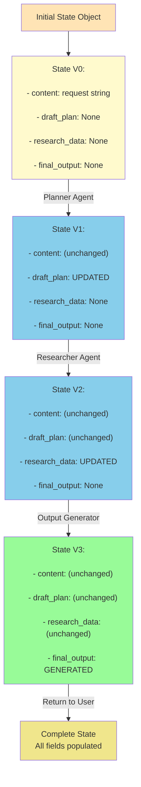
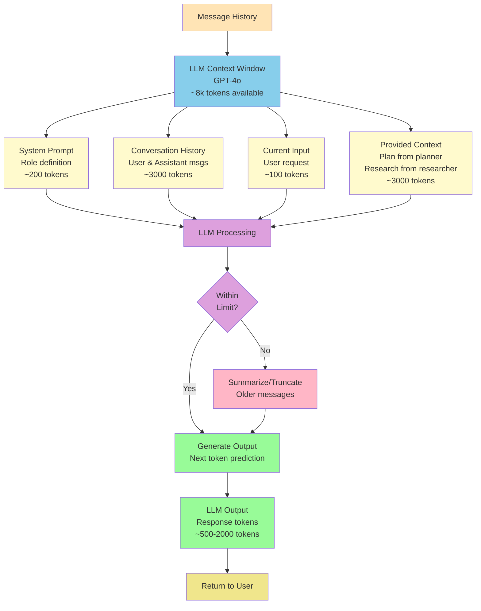
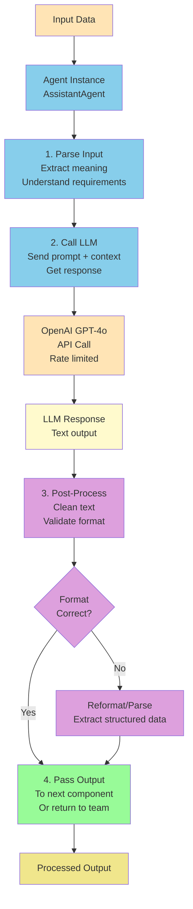
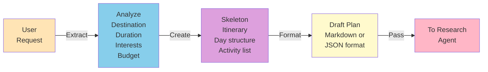
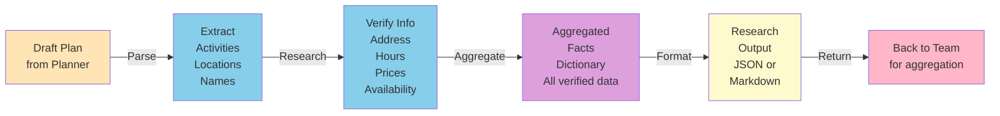
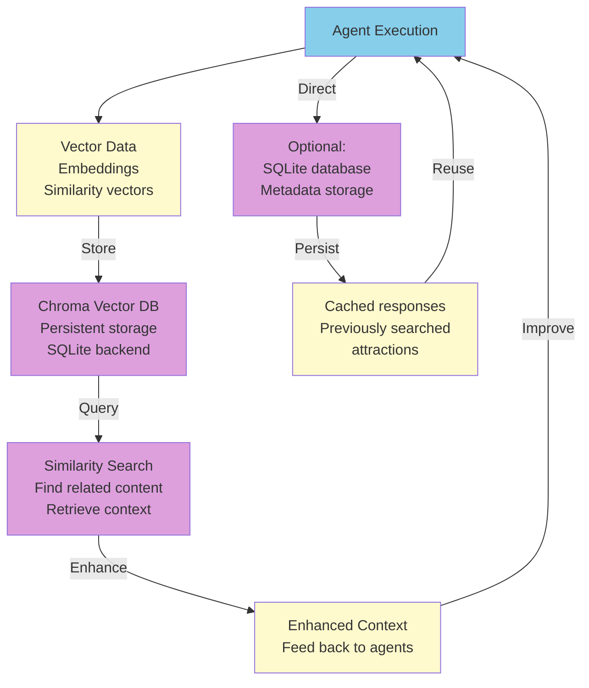
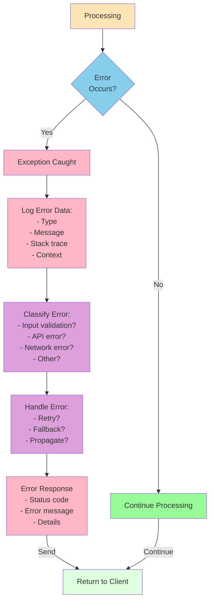
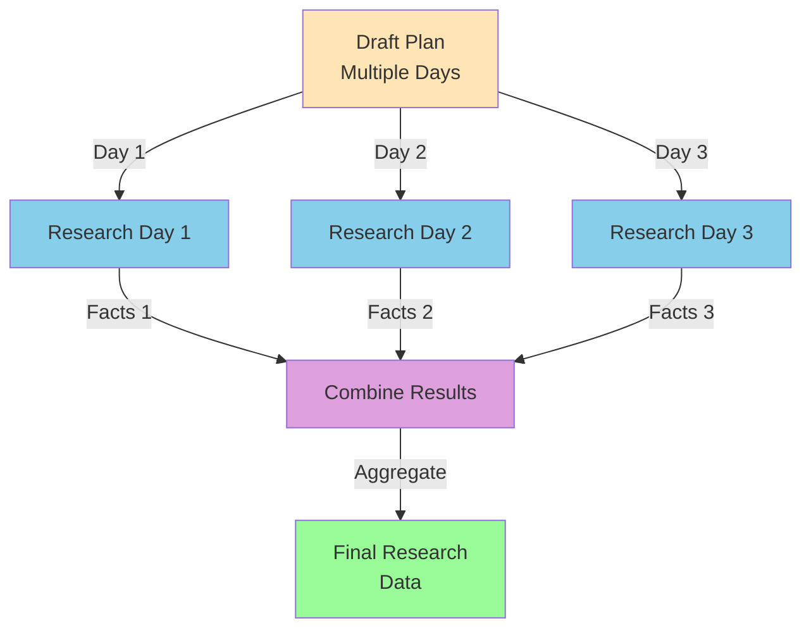

# Data Flow Diagram

This document shows how data flows through the entire Holiday Management Agent system.

## Complete Data Flow

```mermaid
graph TD
    User["User"] -->|Input Request| Input["Raw User Input<br/>e.g., '7-day trip to Japan<br/>for anime and food'"]
    
    Input -->|Type Check| Validate["PlanRequest Model<br/>Pydantic Validation"]
    
    Validate -->|Valid| TextMsg["TextMessage Object<br/>content: request<br/>source: 'User'"]
    
    TextMsg -->|Passed to| Team["Holiday Team<br/>RoundRobinGroupChat"]
    
    Team -->|Distribution| Planner["Planning Agent<br/>Process & LLM Call"]
    
    Planner -->|Output| DraftPlan["Draft Plan Data<br/>List of activities<br/>by day"]
    
    DraftPlan -->|Passed to| Researcher["Research Agent<br/>Process & LLM Call"]
    
    Researcher -->|Output| ResearchData["Research Data<br/>Dict of verified facts<br/>addresses, prices, hours"]
    
    DraftPlan -.->|Feed| Context["Context Window<br/>LLM Memory"]
    ResearchData -.->|Feed| Context
    
    Context -->|Generate| Final["Final Itinerary<br/>Markdown format<br/>Day-by-day plan"]
    
    Final -->|Aggregate| Messages["Message Objects<br/>source + content"]
    
    Messages -->|Format| Response["JSON Response<br/>{messages: [...]}")
    
    Response -->|Send| Client["Client/Browser"]
    
    Client -->|Render| Display["Displayed Itinerary<br/>Formatted text"]
    
    Display -->|User Action| Export["Export/Share<br/>Save as file"]
    
    style User fill:#E0FFE0
    style Input fill:#FFE4B5
    style Validate fill:#87CEEB
    style TextMsg fill:#87CEEB
    style Team fill:#DDA0DD
    style Planner fill:#87CEEB
    style DraftPlan fill:#FFFACD
    style Researcher fill:#87CEEB
    style ResearchData fill:#FFFACD
    style Context fill:#F0E68C
    style Final fill:#98FB98
    style Messages fill:#F0E68C
    style Response fill:#F0E68C
    style Client fill:#E0FFE0
    style Display fill:#FFFACD
    style Export fill:#FFFACD
```

## State Object Transformation



## LLM Context Window Data Flow



## Agent Processing Pipeline



## Request/Response Data Transformation

```mermaid
graph TB
    Client["Client<br/>Browser/API"]
    
    Client -->|HTTP POST| Request["HTTP Request<br/>JSON Body<br/>Content-Type: application/json<br/>
    {
      'content': 'string',
      'source': 'string'
    }"]
    
    Request -->|Parse| JsonParse["JSON Parser"]
    
    JsonParse -->|Extract| Fields["Extract Fields:<br/>- content<br/>- source"]
    
    Fields -->|Map to| PydanticModel["Pydantic PlanRequest<br/>Type: str<br/>Type: str<br/>Validate constraints"]
    
    PydanticModel -->|Validated| AppData["Application Data<br/>Python objects<br/>Type-safe"]
    
    AppData -->|Process| Team["Team Processing<br/>Agent execution<br/>LLM calls"]
    
    Team -->|Generate| Results["Results List<br/>Multiple Message objects<br/>source + content pairs"]
    
    Results -->|Structure| ResponseModel["Pydantic PlanResponse<br/>messages: List[Message]<br/>Validate schema"]
    
    ResponseModel -->|Serialize| JsonSerialize["JSON Serializer<br/>Pydantic .json()"]
    
    JsonSerialize -->|Create| JsonResponse["JSON Response<br/>Content-Type: application/json<br/>
    {
      'messages': [
        {
          'source': 'Agent',
          'content': 'text'
        }
      ]
    }"]
    
    JsonResponse -->|HTTP| Response["HTTP Response<br/>Status: 200<br/>Headers<br/>Body"]
    
    Response -->|Send| Client
    
    style Client fill:#E0FFE0
    style Request fill:#FFE4B5
    style JsonParse fill:#87CEEB
    style Fields fill:#87CEEB
    style PydanticModel fill:#87CEEB
    style AppData fill:#FFFACD
    style Team fill:#DDA0DD
    style Results fill:#FFFACD
    style ResponseModel fill:#87CEEB
    style JsonSerialize fill:#87CEEB
    style JsonResponse fill:#FFE4B5
    style Response fill:#98FB98
```



## Data Flow: Planning Phase



## Data Flow: Research Phase



## Database Data Flow



## Error Data Flow



## Memory Flow During Execution

```mermaid
graph TB
    Start["Agent Starts"] --> Memory1["Memory State 1:<br/>- System prompt loaded<br/>- Empty history<br/>- Initial context"]
    
    Memory1 -->|First Input| Message1["Message 1:<br/>User request<br/>received"]
    
    Message1 -->|Store| Memory2["Memory State 2:<br/>- System prompt<br/>- Message 1 stored<br/>- Processing context"]
    
    Memory2 -->|Generate| Output1["Output 1:<br/>Agent response<br/>generated"]
    
    Output1 -->|Store| Memory3["Memory State 3:<br/>- System prompt<br/>- Message 1+2 stored<br/>- Response context"]
    
    Memory3 -->|Next Input| Message2["Message 2:<br/>Feedback/next step<br/>received"]
    
    Message2 -->|Store| Memory4["Memory State 4:<br/>- System prompt<br/>- Messages 1-3 stored<br/>- Continuation context"]
    
    Memory4 -->|Check| Limit{Token<br/>Limit?}
    
    Limit -->|Exceeded| Truncate["Truncate old<br/>messages<br/>Keep context"]
    Limit -->|OK| Continue["Continue"]
    
    Truncate --> Memory5["Memory State 5:<br/>- System prompt<br/>- Recent messages<br/>- Summary of old"]
    
    Memory5 --> Continue
    
    Continue --> Output2["Final Output:<br/>Complete<br/>response"]
    
    style Start fill:#FFE4B5
    style Memory1 fill:#FFFACD
    style Message1 fill:#FFE4B5
    style Memory2 fill:#FFFACD
    style Output1 fill:#98FB98
    style Memory3 fill:#FFFACD
    style Message2 fill:#FFE4B5
    style Memory4 fill:#FFFACD
    style Limit fill:#DDA0DD
    style Truncate fill:#FFB6C6
    style Memory5 fill:#FFFACD
    style Continue fill:#98FB98
    style Output2 fill:#98FB98
```



## Parallel Data Processing (Future)



---

For more details, see:
- [Overall Workflow](overall_workflow.md)
- [Planning Agent Workflow](planning_agent_workflow.md)
- [Research Agent Workflow](research_agent_workflow.md)
- [FastAPI Flow](fastapi_flow.md)
