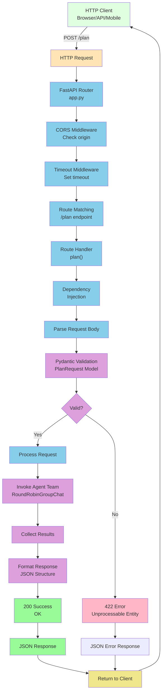
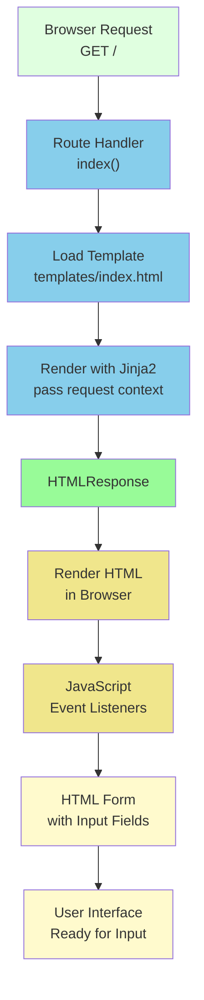
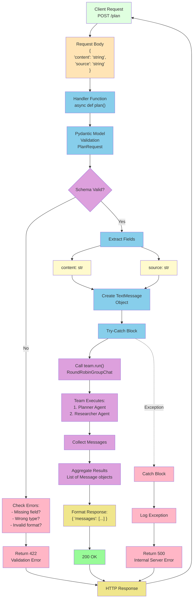
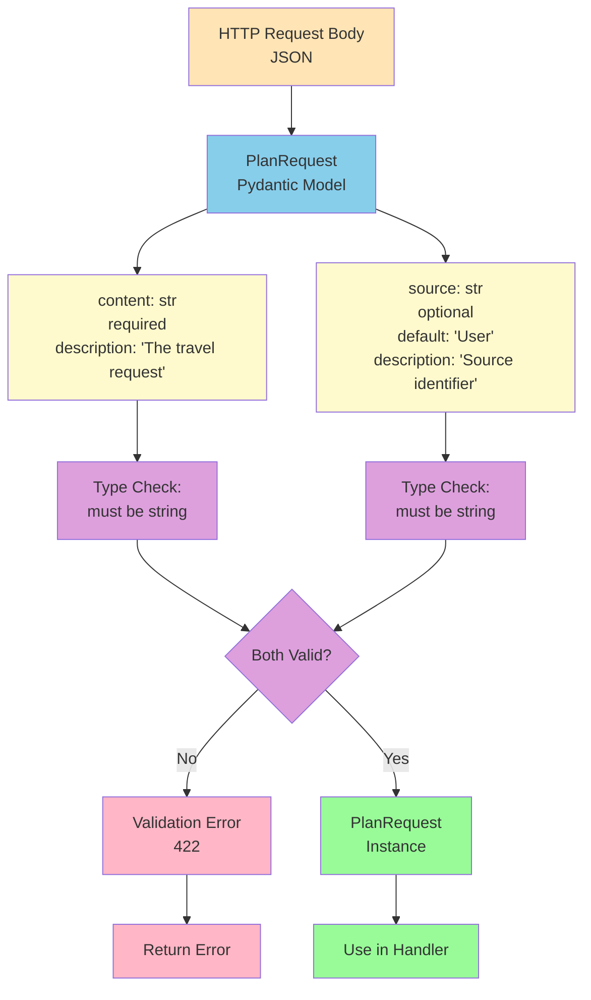
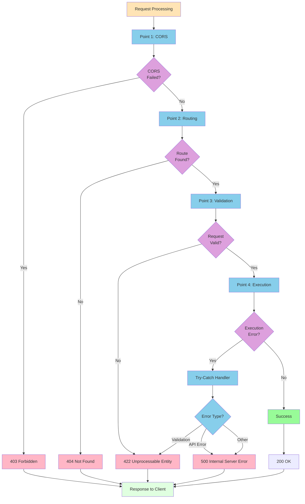
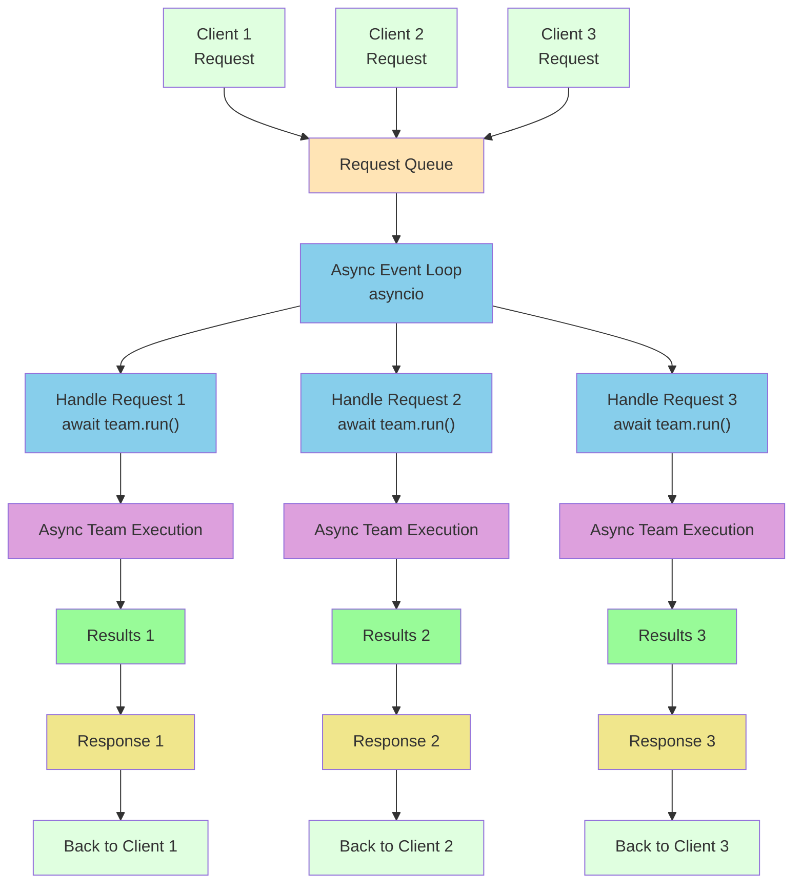
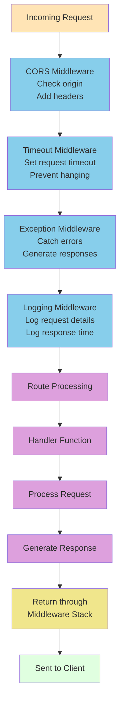
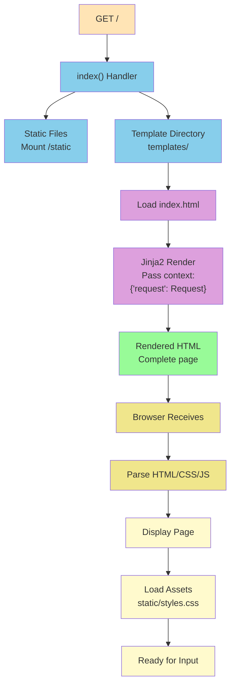
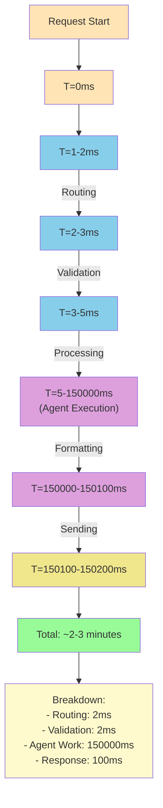

# FastAPI Request Flow

This document details the HTTP request/response flow through the FastAPI application.

## Request Handling Pipeline



## Endpoint Details

### GET / Endpoint



### POST /plan Endpoint



## Request/Response Models

### PlanRequest Model



### PlanResponse Model

```mermaid
graph TB
    Data["Agent Results"] --> Format["Format Response"]
    
    Format --> Response["PlanResponse<br/>Pydantic Model"]
    
    Response --> Field["messages: List<br/>Array of Message objects"]
    
    Field --> Message["Message Object<br/>- source: str<br/>- content: str"]
    
    Message --> Ex1["Example:<br/>source: 'Holiday_Planner'<br/>content: 'Day 1: ...']
    Message --> Ex2["Example:<br/>source: 'Holidaya_Researcher'<br/>content: 'Verified: ...'"]
    
    Ex1 --> JSON["Serialize to JSON"]
    Ex2 --> JSON
    
    JSON --> Response["HTTP Response<br/>200 OK<br/>Content-Type: application/json"]
    
    Response --> Client["Send to Client"]
    
    style Data fill:#FFE4B5
    style Format fill:#87CEEB
    style Response fill:#87CEEB
    style Field fill:#FFFACD
    style Message fill:#DDA0DD
    style Ex1 fill:#FFFACD
    style Ex2 fill:#FFFACD
    style JSON fill:#F0E68C
    style Client fill:#E0FFE0
```

## Error Handling Flow



## Async Request Handling



## Middleware Stack



## Static Files & Templates



## Performance Metrics



---

For related workflows, see:
- [Overall Workflow](overall_workflow.md)
- [Data Flow](data_flow.md)
- [API Documentation](../docs/API.md)
