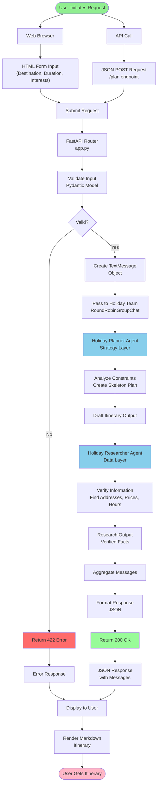
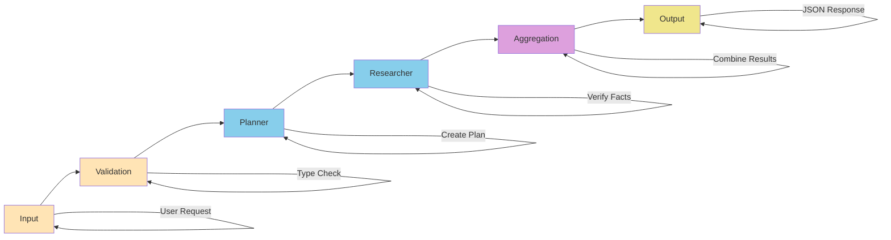
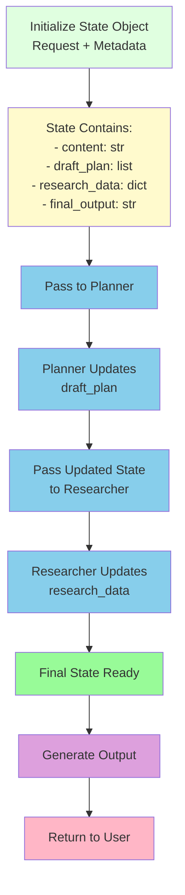
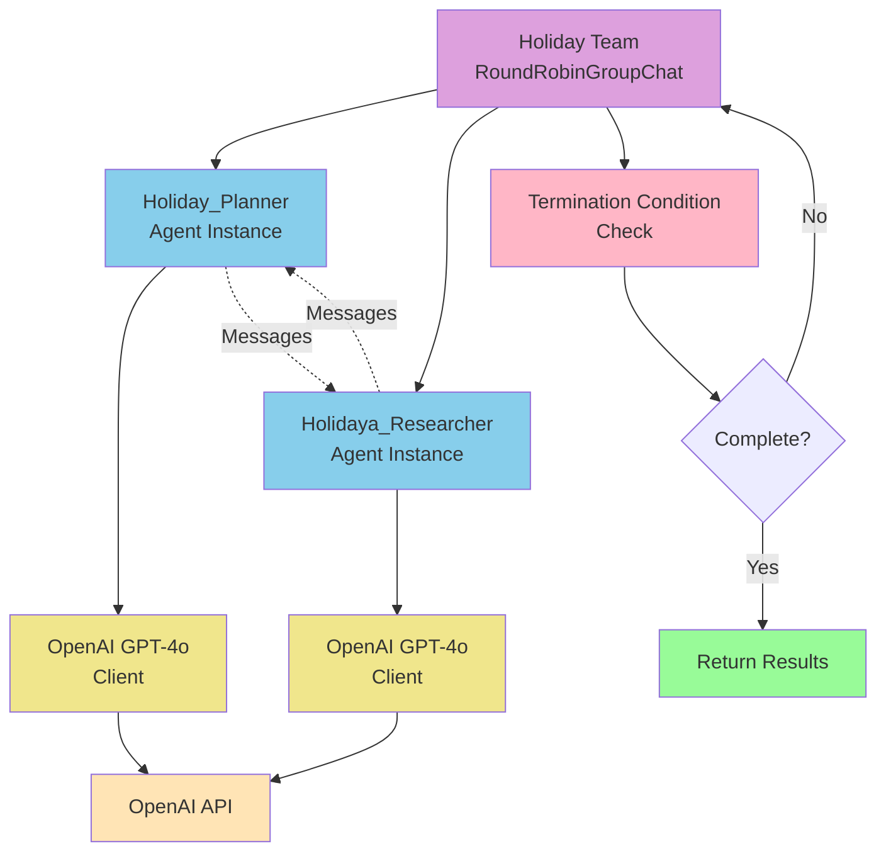
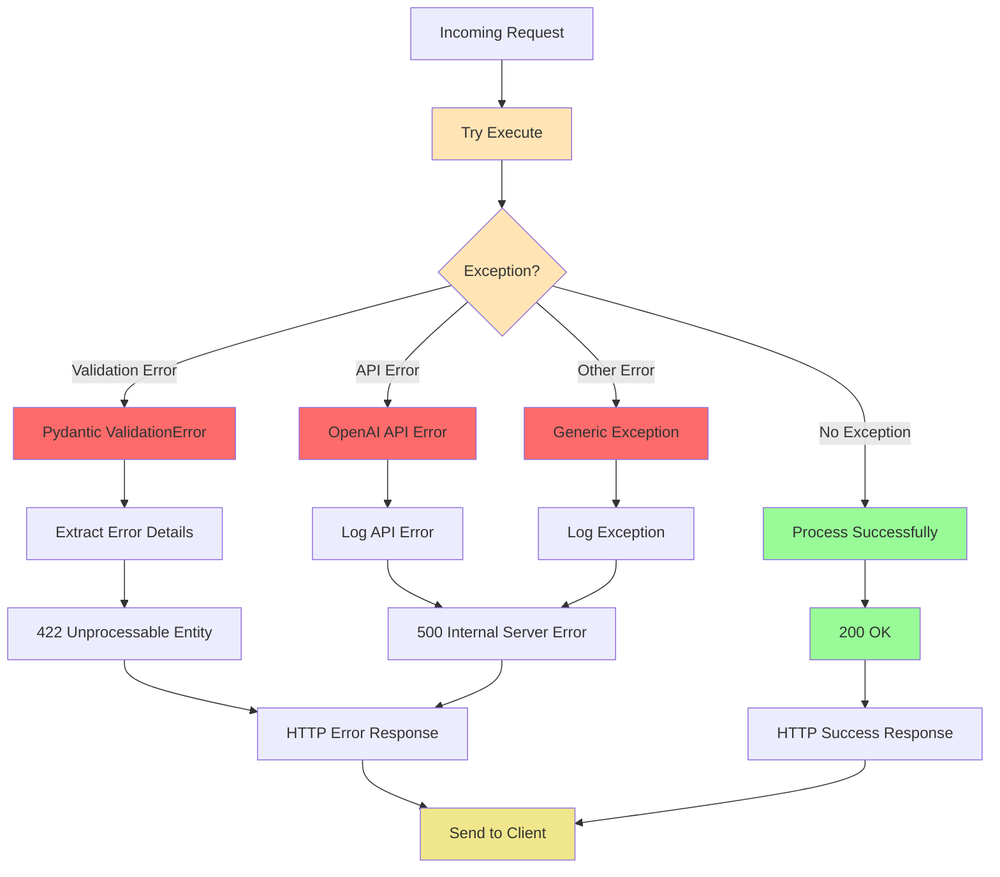
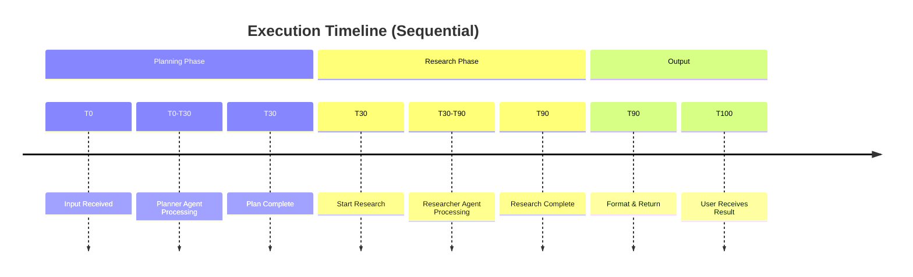
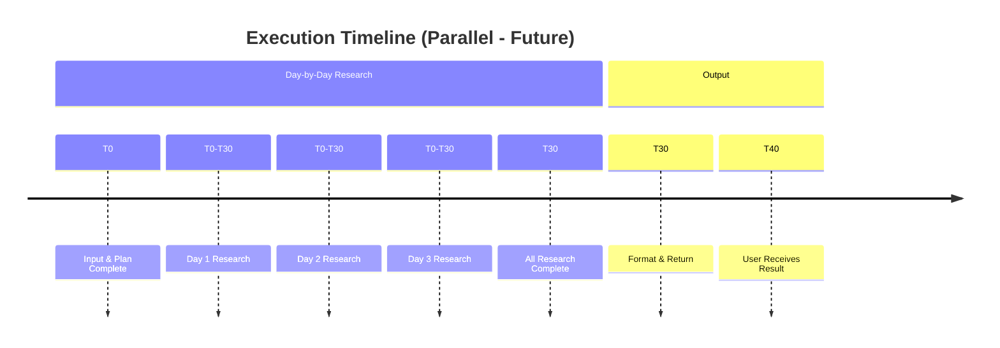
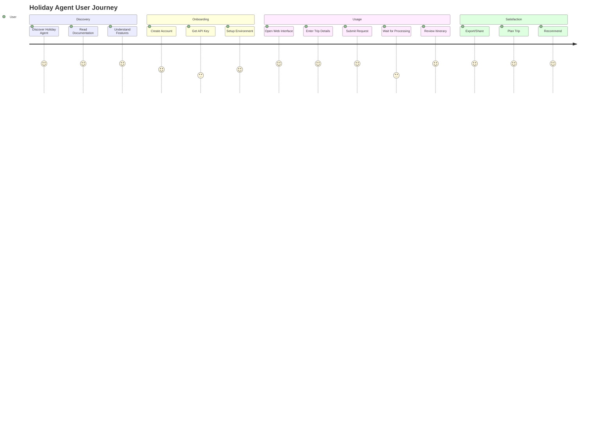
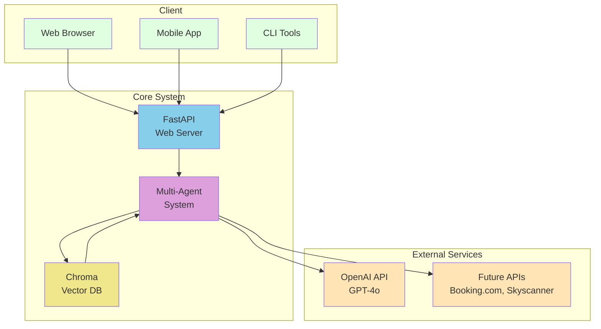

# Overall System Workflow

This document shows the complete end-to-end workflow of the Holiday Management Agent system.

## Main System Flow

## Processing Pipeline

## State Management Flow

## Team Orchestration

## Error Handling Path

## Concurrent vs Sequential Processing

### Current: Sequential Processing

### Future: Parallel Processing

## User Journey

## Integration Points

---

For more details, see:
- [Planning Agent Workflow](planning_agent_workflow.md)
- [Research Agent Workflow](research_agent_workflow.md)
- [FastAPI Flow](fastapi_flow.md)
- [Data Flow](data_flow.md)
