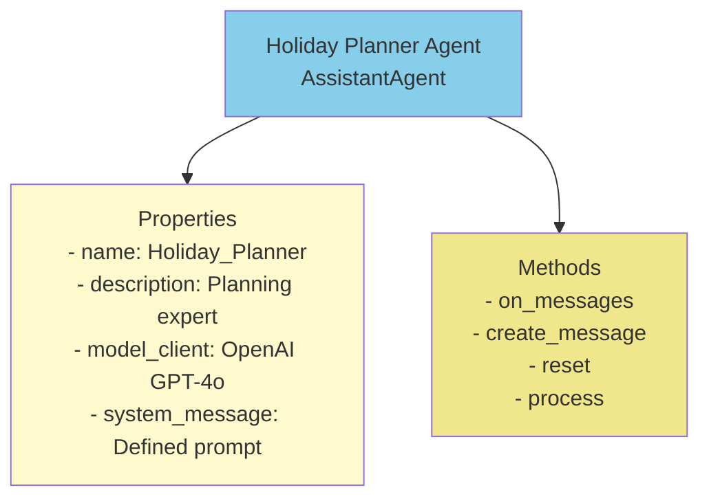
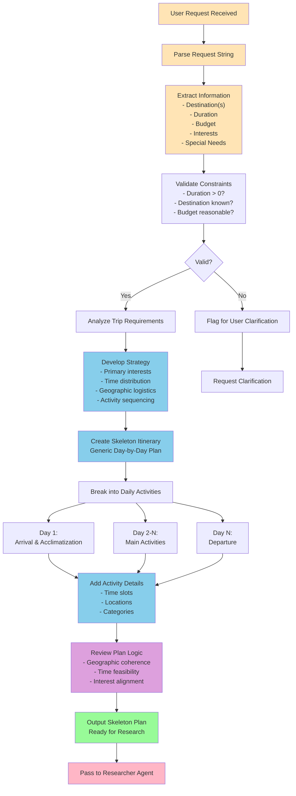
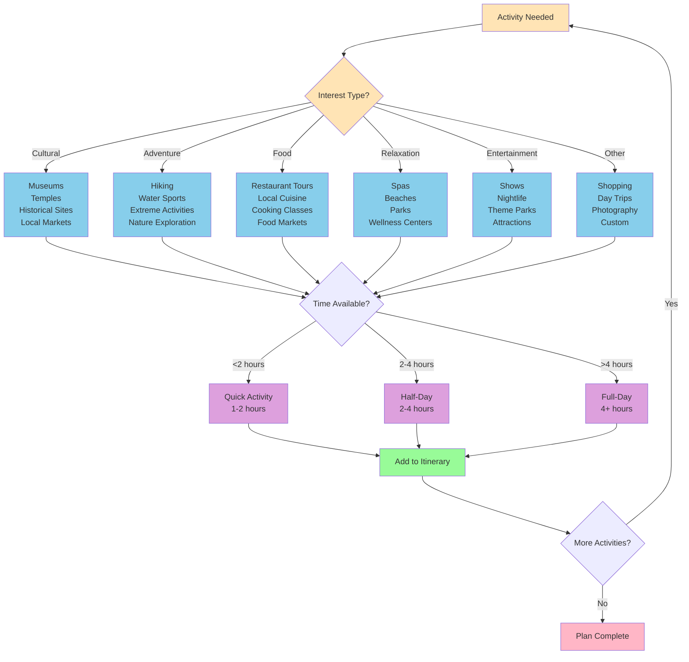
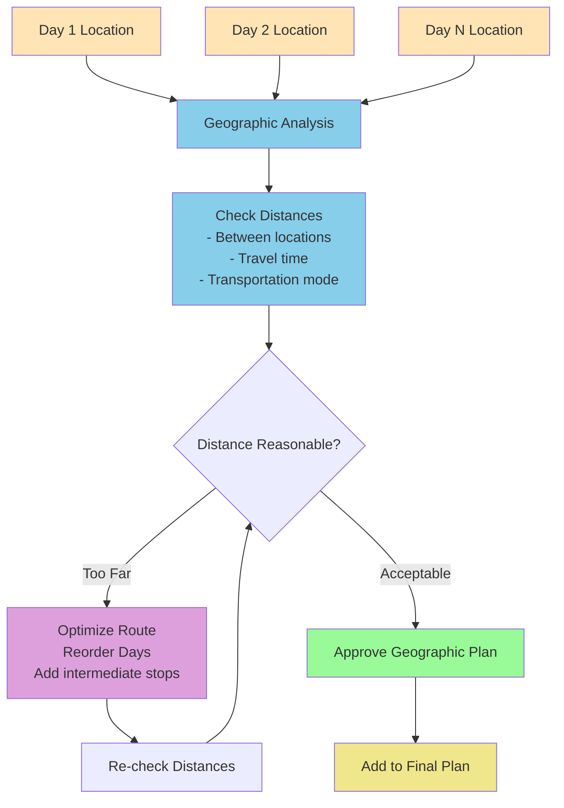
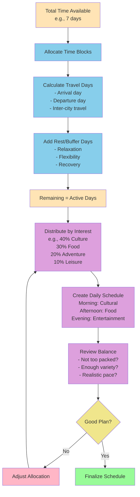
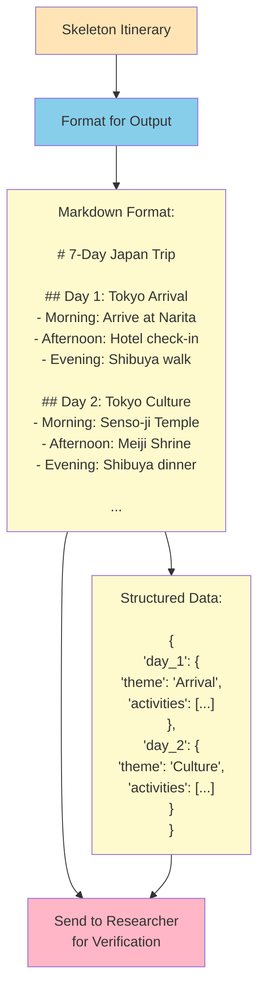
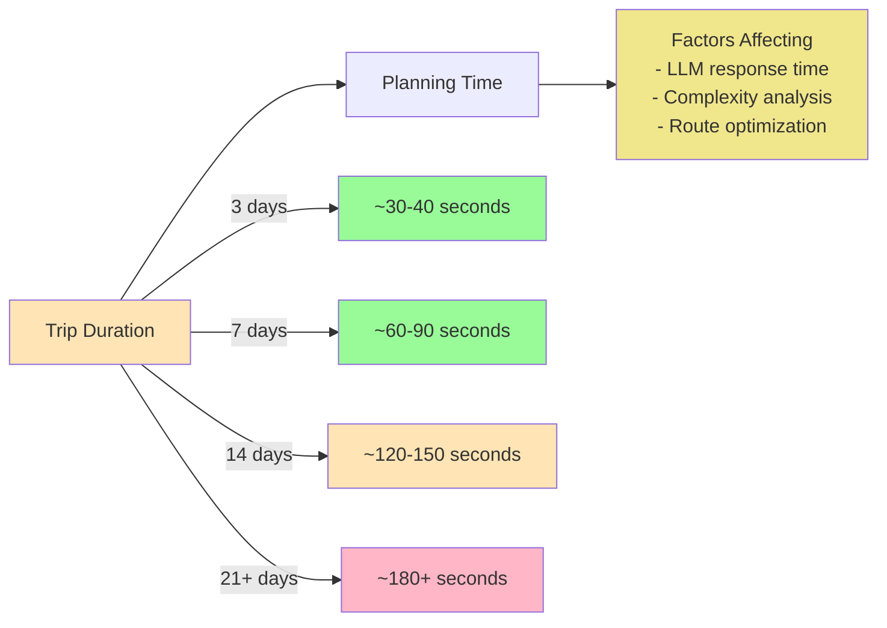
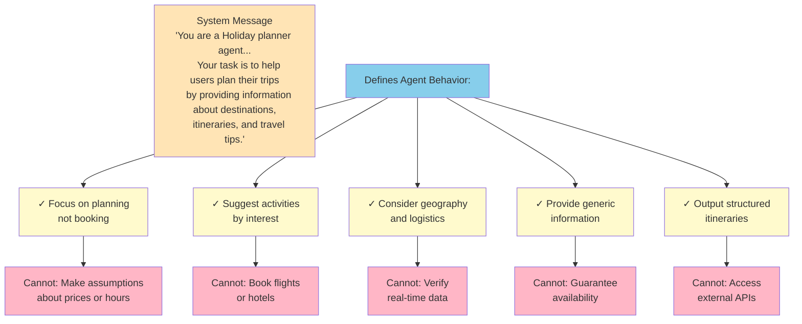

# Planning Agent Workflow

This document details the Holiday Planner Agent workflow and its decision-making process.

## Agent Overview

## Planning Process Flow

## Decision Tree: Activity Selection

## Geographic Coherence Check

## Time Allocation Logic

## Output Format

## Performance Considerations

## System Message & Behavior

---

For related workflows, see:
- [Research Agent Workflow](research_agent_workflow.md)
- [Overall Workflow](overall_workflow.md)
- [Data Flow](data_flow.md)
