# Research Agent Workflow

This document details the Holiday Researcher Agent workflow and its data validation process.

## Agent Overview

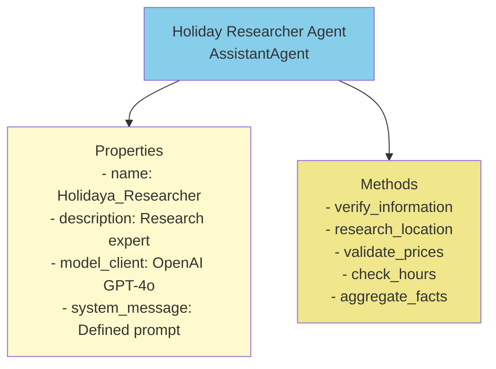

## Research Process Flow

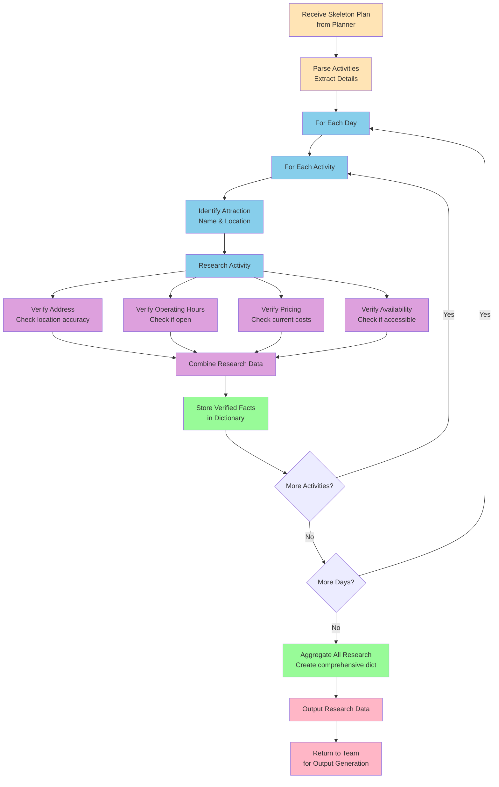

## Verification Pipeline

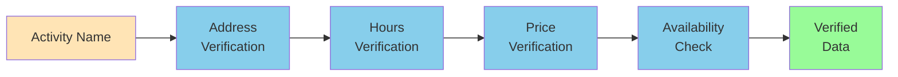

## Address Verification Logic

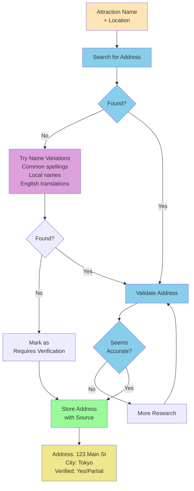

## Hours of Operation Verification

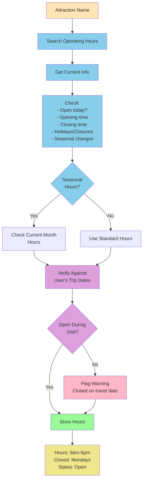

## Price Verification Logic

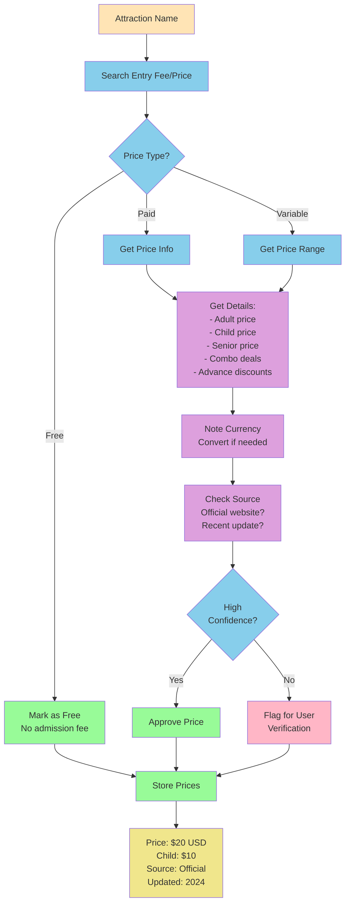

## Availability & Accessibility Check

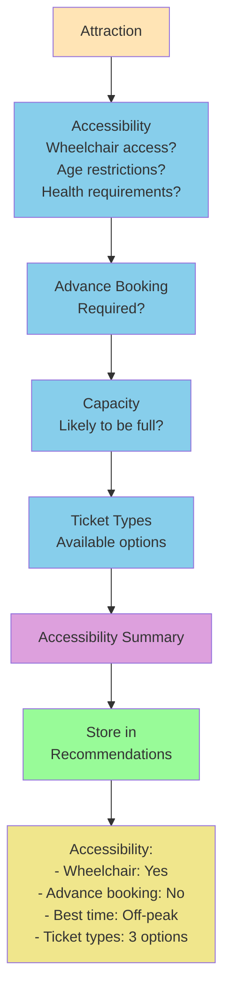

## Data Quality Assessment

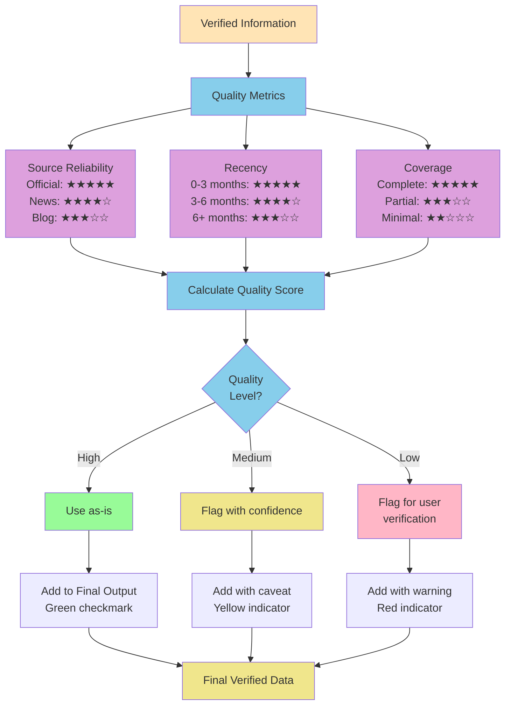

## Output Structure

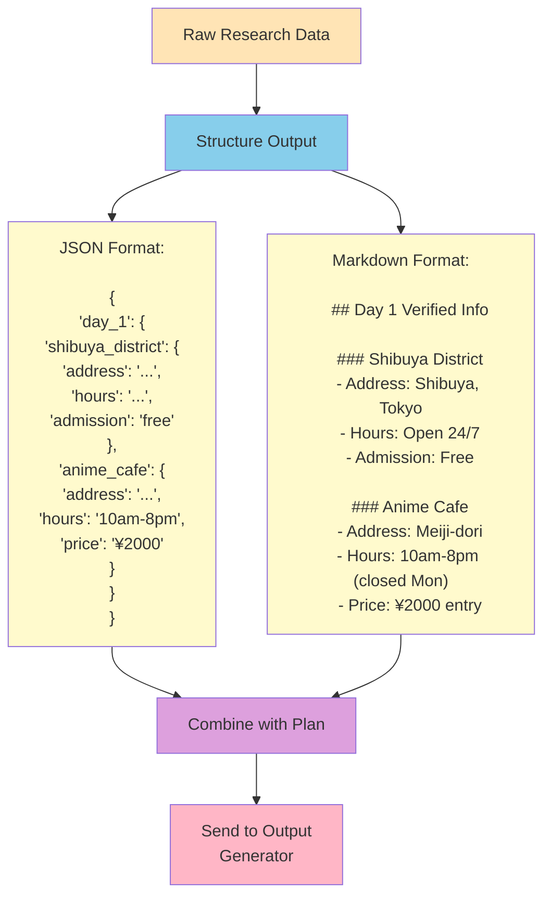

## Performance Considerations

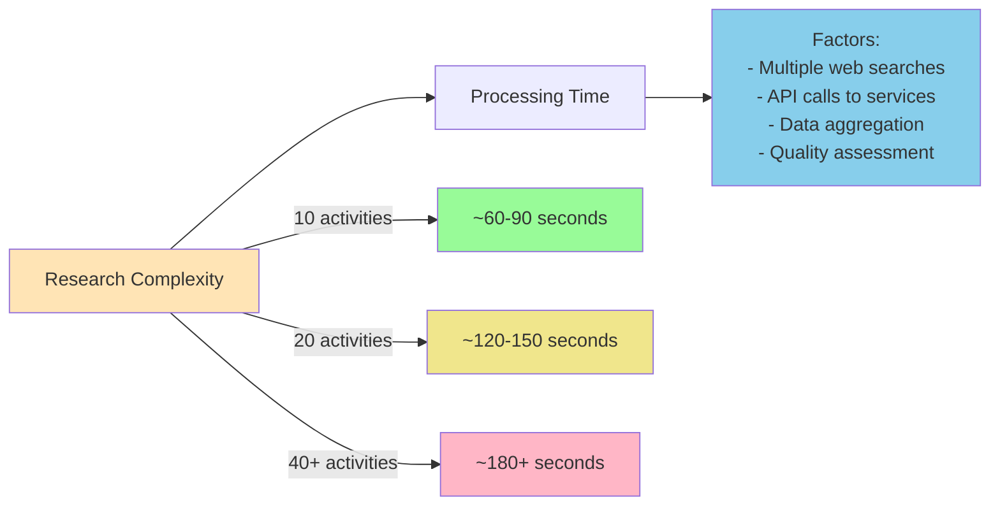

## Hallucination Prevention

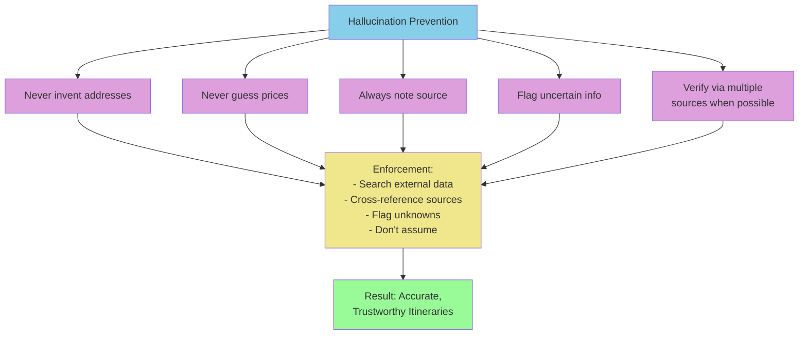

---

For related workflows, see:
- [Planning Agent Workflow](planning_agent_workflow.md)
- [Overall Workflow](overall_workflow.md)
- [Data Flow](data_flow.md)
